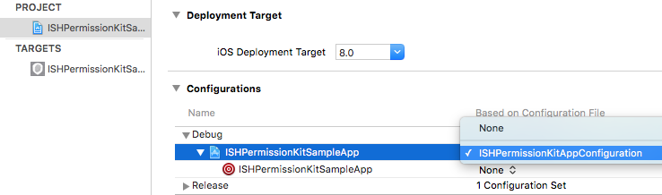

#  ISHPermissionKitSampleApp

This app demonstrates how to integrate and use [*ISHPermissionKit*](https://github.com/iosphere/ISHPermissionKit):

> A polite and unified way of asking for permission on iOS

The sample app uses our recommended way of using open source libraries: 

* Use [git submodules](https://git-scm.com/book/en/v2/Git-Tools-Submodules) to 
fetch *ISHPermissionKit*

* Integrate the *ISHPermissionKit* project as a subproject of the app's project

* Embed and link the dynamic library target of *ISHPermissionKit*

Other ways of integrating *ISHPermissionKit*, including CocoaPods, are outlined in the 
framework repository's [README](https://github.com/iosphere/ISHPermissionKit/blob/master/README.md).

# Checkout

To check out the sample app including the framework, you can use the following command:

`git submodule update —-init —-recursive`

# Notes

This sample app includes all basic steps that are necessary to configure 
*ISHPermissionKit*, notably:

* Provide a [build configuration](/submodules/ISHPermissionKitAppConfiguration.xcconfig)
to enable the desired features. Please note the file name and the relative
file path compared to the framework directory - both need to be exactly
as demonstrated, else the configuration will not be found.

* The demo app uses the same configuration file to ensure autocompletion
works correctly. You must add the configuration file to your project,
but it should not be part of any target.

* Provide static usage descriptions in the [Info PLIST](/ISHPermissionKitSampleApp/Info.plist)

The sample app does not enable capabilities that are required for certain
features (e.g., HealthKit and Notifications) to ensure it builds for the
simulator without an App ID or other configuration.

# Attribution

*ISHPermissionKit* icon designed by 
[Jason Grube (CC BY 3.0)](http://thenounproject.com/term/fingerprint/23303/) from the 
[Noun Project](http://thenounproject.com)
